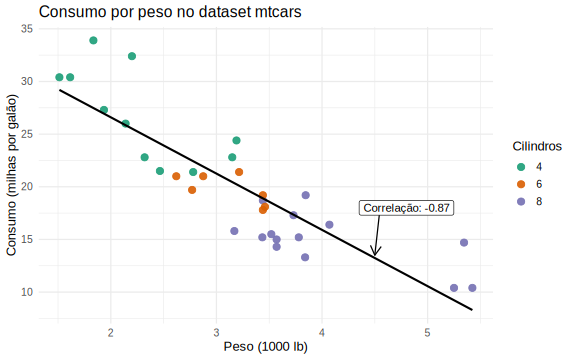

# Relatório

## Identificação

- **Nome**: GPT-5.5 (medium)
- **Cartão UFRGS:** 999999

## Dados utilizados

1. **Dataset mtcars**: <https://www.rdocumentation.org/packages/datasets/topics/mtcars>
    * **Descrição curta**: conjunto de dados nativo do R com informações de consumo e características de 32 automóveis publicados na revista Motor Trend em 1974.

## Código-fonte da visualização

- **Arquivo principal**: [plot.R](plot.R)
- **Arquivos complementares (se houver)**: [plot.ipynb](plot.ipynb)
    - Versão do `plot.R` compatível com Google Colab

## Imagem da visualização gerada

## Descrição da visualização

### Legenda (*caption*)

Scatterplot do consumo (`mpg`, em milhas por galão) em função do peso (`wt`, em milhares de libras) para os automóveis do dataset `mtcars`. Cada ponto representa um automóvel, e a cor indica o número de cilindros (`cyl`): 4, 6 ou 8.

### Conclusão demonstrada pela visualização

A visualização mostra uma relação negativa entre peso e consumo: automóveis mais pesados tendem a apresentar menor valor de `mpg`. Também é possível observar que carros com 8 cilindros se concentram entre os mais pesados e menos econômicos, enquanto carros com 4 cilindros tendem a ser mais leves e econômicos.
